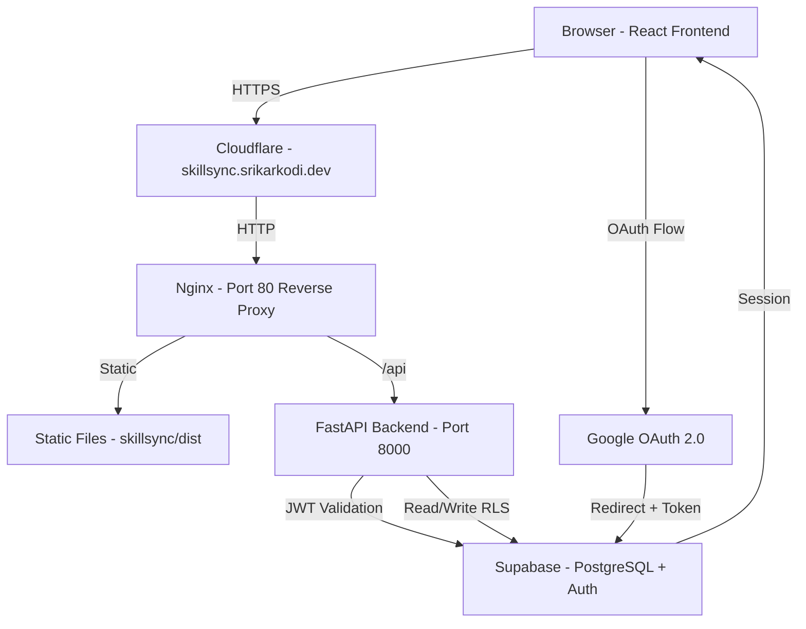
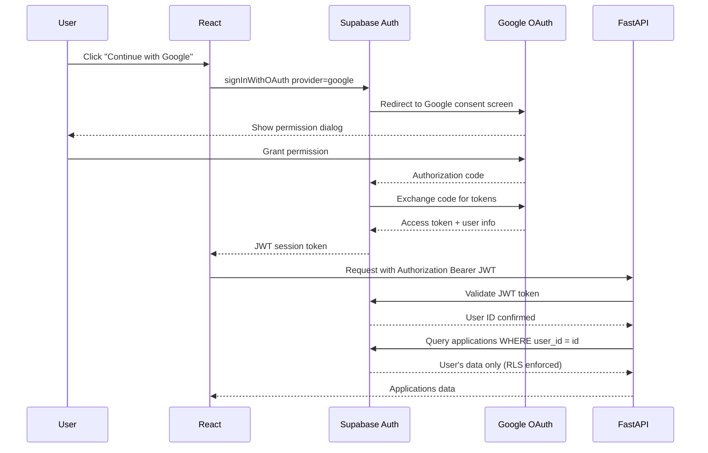
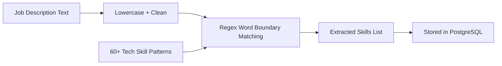
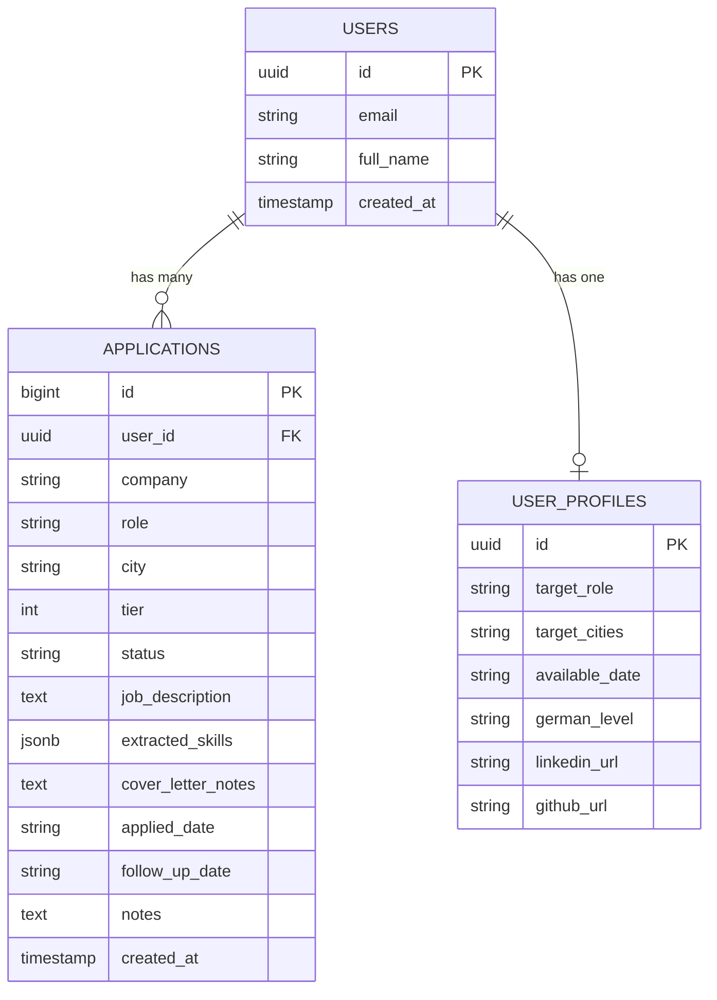
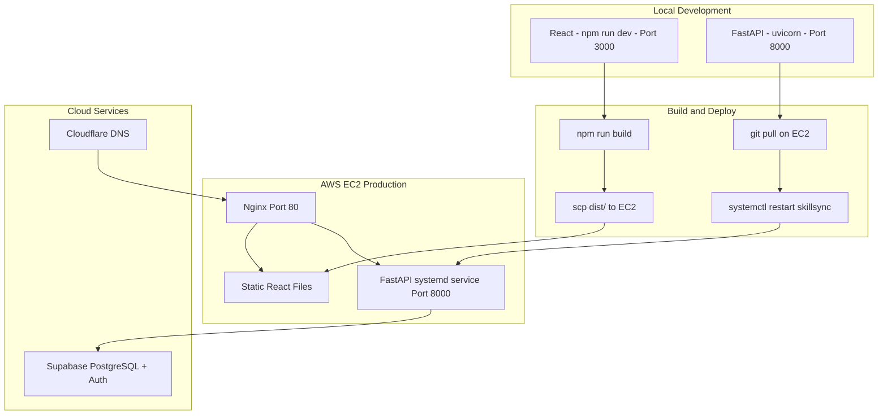

# SkillSync — AI Job Application Tracker
### skillsync.srikarkodi.dev

> A production-grade job application tracker with NLP skill extraction, pipeline analytics, Google OAuth, and PostgreSQL. Built for real job searches — currently tracking 50+ applications across Germany.

---

## 🌐 Live

[skillsync.srikarkodi.dev](http://skillsync.srikarkodi.dev)

---

## 🏗️ System Architecture



---

## 🔐 Authentication Flow



---

## 🧠 NLP Skill Extraction Flow



---

## 🗄️ Database Schema



---

## 🚀 Deployment Architecture



---

## 🛠️ Tech Stack

| Layer | Technology | Purpose |
|-------|-----------|---------|
| Frontend | React 18, Vite, Tailwind CSS | UI framework |
| Charts | Recharts | Pipeline analytics charts |
| Auth | Supabase Auth + Google OAuth | User authentication |
| Backend | Python, FastAPI | REST API |
| NLP | Python regex, custom patterns | Skill extraction |
| Database | Supabase PostgreSQL | Persistent storage |
| Security | Row Level Security | Data isolation per user |
| Server | AWS EC2 t3.micro | Compute |
| Process | systemd | Auto-restart on crash |
| Web Server | Nginx | Reverse proxy |
| DNS | Cloudflare | Domain routing |

---

## ✨ Features

### Core
- **Google OAuth login** — mandatory, session-based, secure
- **Add applications** — company, role, city, tier (1-4), applied date
- **NLP skill extraction** — paste any JD, get 60+ tech skills extracted instantly
- **Status pipeline** — Not Applied → Applied → Callback → Interview → Offer → Rejected
- **Follow-up reminders** — set dates, see alerts on dashboard
- **Find referral** — LinkedIn search, Hunter.io, company LinkedIn — one click
- **Bulk load** — load all 37 target companies from master plan at once

### Dashboard Analytics
- **5 KPI cards** — Total, Callbacks, Interviews, Offers, Callback Rate
- **Bar chart** — applications by status
- **Donut chart** — pipeline breakdown by tier
- **Follow-up alerts** — companies due for contact today

### Profile
- Target role, target cities, available date, German level
- LinkedIn and GitHub links
- Edit and save — persisted in PostgreSQL

### Security
- **Row Level Security** on all tables — users can only see their own data
- **JWT validation** on every API endpoint
- **No admin backdoor** — even the server cannot read other users' data

---

## 📁 Project Structure

```
SkillSync/
├── app/
│   └── main.py                 FastAPI routes with JWT auth
├── utils/
│   ├── nlp.py                  Skill extractor - 60+ tech patterns
│   └── storage.py              Supabase PostgreSQL client
├── frontend/
│   ├── src/
│   │   ├── components/
│   │   │   ├── Auth.jsx        Google login page
│   │   │   ├── Sidebar.jsx     Navigation with user avatar
│   │   │   └── StatusBadge.jsx Coloured status pill
│   │   ├── pages/
│   │   │   ├── Landing.jsx     Public landing page
│   │   │   ├── Dashboard.jsx   KPIs + charts
│   │   │   ├── Applications.jsx Table with expand + edit
│   │   │   ├── AddApplication.jsx Form + NLP + bulk load
│   │   │   ├── NLPExtractor.jsx  Standalone skill extractor
│   │   │   └── Profile.jsx     User profile management
│   │   ├── hooks/
│   │   │   └── useApplications.js Data fetching + auth headers
│   │   └── lib/
│   │       └── supabase.js     Supabase client
│   └── package.json
├── requirements.txt
└── .env                        SUPABASE_URL, SUPABASE_ANON_KEY, SUPABASE_SERVICE_KEY
```

---

## 🔧 Running Locally

### Backend
```bash
git clone https://github.com/Namidok/SkillSync.git
cd SkillSync
python3.11 -m venv venv
source venv/bin/activate
pip install -r requirements.txt

# Create .env
cat > .env << 'ENVEOF'
SUPABASE_URL=your_supabase_url
SUPABASE_ANON_KEY=your_anon_key
SUPABASE_SERVICE_KEY=your_service_key
ENVEOF

uvicorn app.main:app --host 0.0.0.0 --port 8000 --reload
```

### Frontend
```bash
cd frontend
npm install
npm run dev
# Opens at http://localhost:3000
```

---

## 🗃️ Supabase Setup

Run in SQL Editor:

```sql
CREATE TABLE applications (
  id BIGSERIAL PRIMARY KEY,
  user_id UUID REFERENCES auth.users(id) ON DELETE CASCADE,
  company TEXT NOT NULL,
  role TEXT NOT NULL,
  city TEXT DEFAULT '',
  tier INTEGER DEFAULT 1,
  status TEXT DEFAULT 'Not Applied',
  job_description TEXT DEFAULT '',
  extracted_skills JSONB DEFAULT '[]',
  cover_letter_notes TEXT DEFAULT '',
  applied_date TEXT DEFAULT '',
  follow_up_date TEXT DEFAULT '',
  notes TEXT DEFAULT '',
  created_at TIMESTAMP WITH TIME ZONE DEFAULT NOW()
);

ALTER TABLE applications ENABLE ROW LEVEL SECURITY;

CREATE POLICY "Users can only access own data"
  ON applications FOR ALL
  USING (auth.uid() = user_id);
```

---

## 🔄 Redeployment

```bash
# Frontend
cd frontend
npm run build
scp -i ~/skillsync-key.pem -r dist ubuntu@3.228.77.181:/home/ubuntu/skillsync/

# Backend
ssh -i ~/skillsync-key.pem ubuntu@3.228.77.181
cd ~/SkillSync
git pull origin main
sudo systemctl restart skillsync
sudo systemctl status skillsync
```

---

## 📡 API Endpoints

| Method | Endpoint | Auth | Description |
|--------|----------|------|-------------|
| GET | `/applications` | JWT | Get all user applications |
| POST | `/applications` | JWT | Add new application |
| PATCH | `/applications/{id}` | JWT | Update status/notes/follow-up |
| DELETE | `/applications/{id}` | JWT | Delete application |
| GET | `/stats` | JWT | Dashboard KPIs |
| POST | `/extract-skills` | None | NLP skill extraction |

---

*Built by Srikar Kodi · MSc AI/ML · Berlin · 2026*